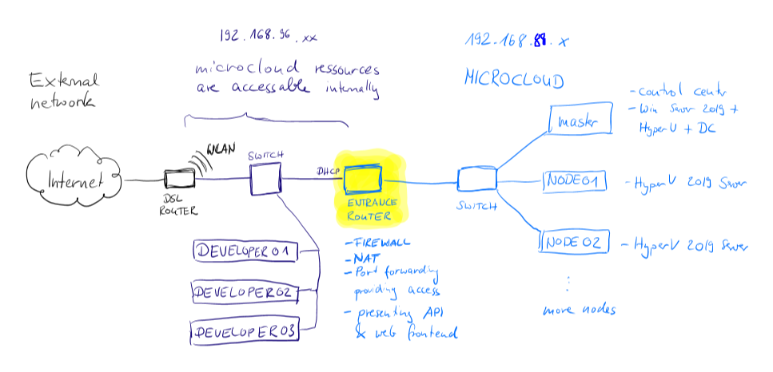

# MicroCloud

A thin management layer for a bunch of hyper-v hosts to create a small, automatable powershell driven private cloud

[Visit the documentation here](https://stho32.github.io/MicroCloud/)

## What exactly do you mean?

  - [I have 3 NUCs. Those things with skulls on them.](https://www.amazon.de/s?k=BOXNUC8I7HNK2+Barebone&i=computers)
  - I added 1 GB SSD and 32 GB RAM each
  - One, lets call it "MASTER", I installed Windows 2019 Server Standard on.
  - Two, lets call them "NODE01" and "NODE02", I installed [the free core hyper-v server 2019 from microsoft on](https://www.microsoft.com/de-de/evalcenter/evaluate-hyper-v-server-2019)
  - The master is installed as Domain Controller and Hyper-V. It manages the domain "microcloud.local". The nodes are joined. (Thus, Powershell Remoting works.)

A little bit of setup and cables later I can start ~18 virtual machines from preconfigured images simply by running a powershell command. [Details on architecture and setup here](docs/architecture.md)

I want it to become a little independent "micro cloud" which will allow me and my collegues to request testing and build environments on demand. 

## Documentation

  - [architecture](docs/architecture.md)
  - [example script master](example.ps1)
  - [configuration for entrance router](docs/configure-mikrotik-entrance-router.md)
  - [creating unattended xml for windows 10 automated installation](https://www.windowscentral.com/how-create-unattended-media-do-automated-installation-windows-10)

