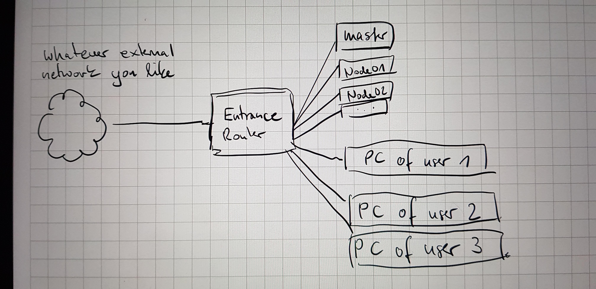
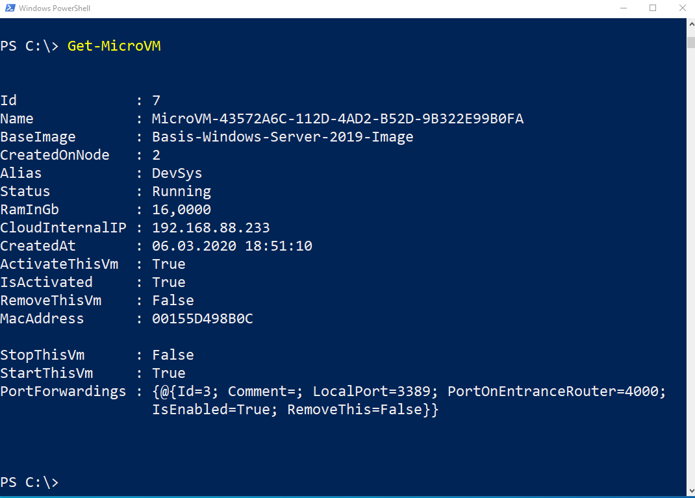

# Screenshots

## drawing of the infrastructure in "external networking" mode

In external networking mode the users computers are placed outside of the microcloud network.

In external networking mode you have the advantage that the microcloud is more encapsulated. 

What is done in the cloud "stays in the cloud" so e.g. the cloud internal ip addresses of the virtual computers are less interesting.

Users can only reach the virtual computers using their shared ports, which are explicitly arranged. 

## drawing of the infrastructure in "internal networking" mode

In internal networking mode the users computers are placed inside the microcloud network.

This enables advanced usage scenarios e.g. developers can create images for virtual computers that contain test-databases, web hosts and so on.
Every developer can then add copies to his own environment. He/she can list her/his own virtual computers with GET-MICROVm and sees the cloud internal ip address. 
Using this and ports that are open on the virtual computers firewalls they can connect and use them.

Since we have IP addresses here its much more easy to redirect access from production to test environment. Just add `192.168.88.xxx productionServerName` to your local hosts file and all traffic that you would normally throw at production becomes redirected to the test server(s).

## get a list of vms currently running for you

With the cmdlet Get-MICROVm you can request a list of virtual machines that are currently running and connected to your api key.
Every user of the microcloud gets an own api key.

## add a new vm to the infrastructure

## connect to an microvm from outside the microcloud infrastructure